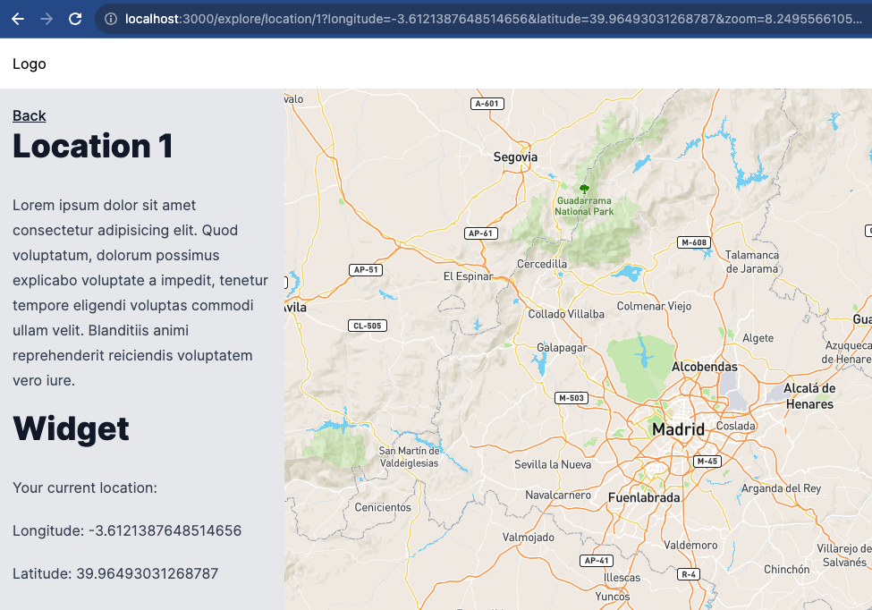

# URL param synchronization in Next 13

An example of implementing URL parameter synchronization with state in a Next.js 13 application. Where there is a map created using [ReactMapGL](https://visgl.github.io/react-map-gl/), and the map's viewport is synchronized with the URL parameters. Finally, there are other components that can change the viewport, and the URL parameters are updated accordingly.



This is a [Next.js](https://nextjs.org/) project bootstrapped with [`create-next-app`](https://github.com/vercel/next.js/tree/canary/packages/create-next-app).

Optionally, you can use [Bun](https://bun.sh/) to manage packages.

## Getting Started

First, run the development server:

```bash
npm run dev
# or
yarn dev
# or
pnpm dev
# or with Bun
bun dev
```

Open [http://localhost:3000](http://localhost:3000) with your browser to see the result.

You can start editing the page by modifying `app/page.tsx`. The page auto-updates as you edit the file.

This project uses [`next/font`](https://nextjs.org/docs/basic-features/font-optimization) to automatically optimize and load Inter, a custom Google Font.

## Learn More

To learn more about Next.js, take a look at the following resources:

- [Next.js Documentation](https://nextjs.org/docs) - learn about Next.js features and API.
- [Learn Next.js](https://nextjs.org/learn) - an interactive Next.js tutorial.
